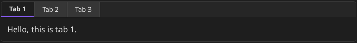

# Tabify

Tabify is a lightweight, efficient Obsidian plugin that lets you organize dense note content into clean, interactive tabbed containers. By utilizing a simple markdown code block syntax, you can seamlessly slice up long text, code snippets, or notes without cluttering your workspace visual layout.



## Features

* **Inline Tabbed Containers:** Group relevant content tightly together inside a single note view.
* **Intuitive Markdown Syntax:** Define tabs naturally using simple `=== Tab Title` block dividers.
* **Native Theme Integration:** Uses default Obsidian CSS variables so it looks beautiful instantly in both Light and Dark modes, regardless of your active community theme.
* **Ultra-Lightweight & Private:** Zero external tracking, zero bloat, and runs entirely locally.

---

## How to Use

Simply create a code block designated with the `tabs` language identifier. Define your tabs by prefixing each new section title with `=== `.

````text
```tabs
=== Tab One
This is standard text content running locally inside my first tab container.

=== Tab Two
This is text running completely independently inside tab two.

=== Tab Three
You can even add a third tab easily!
````

### How to preview:

1. Paste the block above into any note.
2. Switch your note to **Reading View** (or click away from the block in **Live Preview** mode) to watch your text transform into an interactive component.

---

## Installation

### Manual Installation (Local)

If you want to try it out or modify the code directly:

1. Download the latest release assets (`main.js`, `manifest.json`, and `styles.css`).
2. Navigate to your Obsidian vault's hidden plugin directory: `/your-vault/.obsidian/plugins/`.
3. Create a folder named `obsidian-tabify` and drop the files inside.
4. Open Obsidian, go to **Settings** -> **Community Plugins**, hit **Refresh**, and toggle **Tabify** to active.

### Via BRAT (Beta Reviewer's Auto-update Tool)

1. Install the **BRAT** plugin from the Obsidian community store.
2. Go to Options for BRAT and click **Add Beta Plugin**.
3. Paste the URL of this repository: `https://github.com/your-github-username/obsidian-tabify`
4. Click **Add Plugin**.

---

## Local Development

Want to study the code or tweak the styling parameters yourself?

1. Clone this repository into your test vault's plugin directory:
   ```bash
   git clone [https://github.com/your-github-username/obsidian-tabify.git](https://github.com/your-github-username/obsidian-tabify.git)
   cd obsidian-tabify
   ```
2. Install build dependencies:
   ```bash
   npm install
   ```
3. Run the compiler in development mode to auto-compile on changes:
   ```bash
   npm run dev
   ```

---

## Funding URL

You can include funding URLs where people who use your plugin can financially support it.

The simple way is to set the `fundingUrl` field to your link in your `manifest.json` file:

```json
{
	"fundingUrl": "https://buymeacoffee.com"
}
```

If you have multiple URLs, you can also do:

```json
{
	"fundingUrl": {
		"Buy Me a Coffee": "https://buymeacoffee.com",
		"GitHub Sponsor": "https://github.com/sponsors",
		"Patreon": "https://www.patreon.com/"
	}
}
```

## API Documentation

See https://docs.obsidian.md
